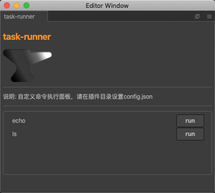

# task-runner-ccc
cocoscreator 命令执行插件



命令执行面板，按照配置文件，显示任务列表，帮助执行用户自定义的系统命令，并刷新指定目录的资产

```json
[
    {
        "command":"echo",//命令
        "args":["${projectPath}/assets/resources/"],//参数列表
        "title":"echo",//显示名称
        "cwd":"${projectPath}",//执行目录
        "refreshDB":"assets/resources/"//刷新资产目录
    },
    {
        "command":"ls",
        "args":[],
        "title":"ls",
        "cwd":"${projectPath}"
    }

]
```
>"${projectPath}" 为项目目录的替换文本，资产刷新目录以项目目录为根目录